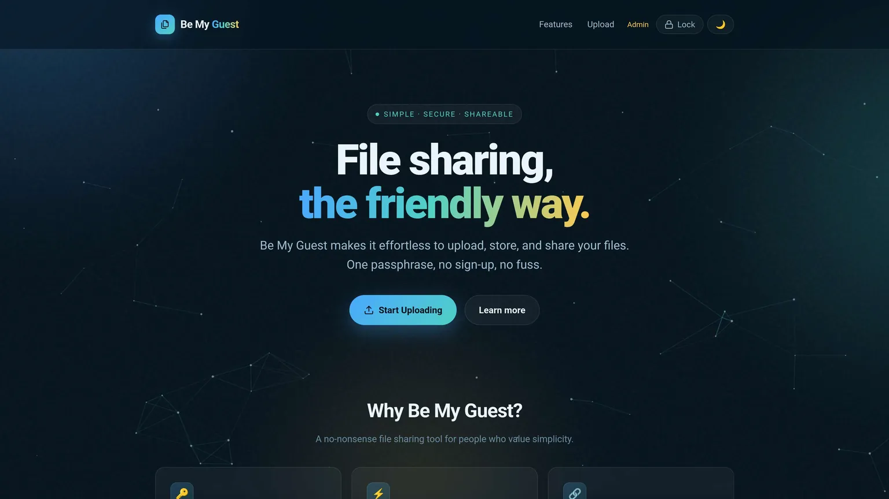

# BeMyGuest

A single-file, passphrase-gated file drop for your LAN. Guests upload; the host
lists, previews, downloads, renames and deletes.

Everything — router, JSON API, HTML, CSS and JavaScript — lives in one
`bmg.php`. No composer, no build step, no database, no dependencies.



## Requirements

**PHP 8.5 or newer.** The code uses the pipe operator (`|>`), `#[\NoDiscard]`,
property hooks, and `new Foo()->bar()` — it will not parse on older versions.

## Run

```sh
PHP_CLI_SERVER_WORKERS=8 php -S 0.0.0.0:8000 bmg.php
```

Then open `http://<host>:8000/`.

The `PHP_CLI_SERVER_WORKERS` env var matters. Without it `php -S` is
single-threaded, so every media Range request queues behind the previous one —
video playback stutters and the whole UI freezes while anything streams.

## Passphrases

Two roles, each a shared passphrase — no accounts, no sign-up:

| Role  | Can do                                                        |
|-------|---------------------------------------------------------------|
| guest | Upload files                                                  |
| admin | Everything guest can, plus list, download, stream, rename, delete |

The shipped defaults are `guest` and `admin`. **Change them before you expose
this to anyone.** Passphrases are stored as SHA-256 hashes in `Cfg`:

```sh
echo -n 'yourpass' | sha256sum
```

Paste the hash into `Cfg::$guestHash` / `Cfg::$adminHash` near the top of
`bmg.php`.

## Configuration

All tunables are constructor defaults on the `Cfg` class:

| Property     | Default                    | Notes                              |
|--------------|----------------------------|------------------------------------|
| `$site`      | `Be My Guest`              | Title and branding                 |
| `$tagline`   | `File sharing, the friendly way` |                              |
| `$guestHash` | sha256 of `guest`          | Change this                        |
| `$adminHash` | sha256 of `admin`          | Change this                        |
| `$uploadDir` | `./uploads`                | Must be writable by the PHP user   |
| `$maxSize`   | 4 GB                       | Enforced per file, in-app          |
| `$maxExec`   | `600`                      | `max_execution_time`               |
| `$memLimit`  | `512M`                     | `memory_limit`                     |
| `$sessKey`   | `bmg_role`                 | Session key holding the role       |

### Upload limits

`upload_max_filesize` and `post_max_size` are `PHP_INI_PERDIR` — they **cannot**
be set from script code. Raise them in `php.ini`, or pass them on the command
line:

```sh
PHP_CLI_SERVER_WORKERS=8 php -S 0.0.0.0:8000 \
    -d upload_max_filesize=4G -d post_max_size=4G bmg.php
```

`Cfg::$maxSize` only rejects oversize files *after* PHP has accepted the POST,
so it needs the ini values to be at least as large to be meaningful.

## Features

- Drag-and-drop or browse multi-file upload, with a live progress bar
- In-browser preview: video, audio and images open in a lightbox
- Range-aware chunked streaming, so `<video>` seeking works on multi-GB files
- Copy-link, rename and delete from the file list (admin only)
- Light/dark theme, remembered in `localStorage`
- Automatic de-duplication — an uploaded name that already exists gets a
  `-1`, `-2`, … suffix rather than overwriting

## API

Every endpoint is `?action=…` against the same file, and returns JSON.

| Action     | Method | Role  | Params            |
|------------|--------|-------|-------------------|
| `auth`     | POST   | —     | `passphrase`      |
| `logout`   | POST   | —     |                   |
| `status`   | GET    | —     |                   |
| `upload`   | POST   | guest | `files[]`         |
| `list`     | GET    | admin |                   |
| `download` | GET    | admin | `file`            |
| `stream`   | GET    | admin | `file` (Range-aware) |
| `rename`   | POST   | admin | `old`, `new`      |
| `delete`   | POST   | admin | `file`            |

## Deployment notes

The `/uploads` guard at the top of `bmg.php` only runs under `php -S`
(`PHP_SAPI === 'cli-server'`). Behind any other server you must block direct
access yourself:

- **Apache** — the bundled `uploads/.htaccess` (`Require all denied`) handles it,
  provided `AllowOverride` permits it.
- **FrankenPHP / Caddy / nginx** — deny `/uploads/*` in the server config.

Uploads are meant to be reachable only through `?action=download` and
`?action=stream`, both of which require the admin role.

## Security

This is a LAN convenience tool, not a hardened public service. Known limits,
stated plainly:

- **No CSRF tokens.** A logged-in admin visiting a hostile page could be made to
  delete or rename files.
- **No rate limiting** on the passphrase form — brute force is unthrottled.
- **No TLS of its own.** Over plain HTTP the passphrase crosses the wire in the
  clear. Put it behind a reverse proxy with TLS if it leaves your LAN.
- Passphrases are plain SHA-256, not a slow password hash.
- Filenames are sanitised to `[\w.\-]` on upload and rename, and lookups use
  `basename()`, so path traversal is blocked — but uploaded *content* is never
  scanned or validated.

Anyone with the guest passphrase can fill your disk.

## Licence

MIT — see [LICENSE](LICENSE).

## Media playback guide

BeMyGuest serves files as-is. Whether a video plays — and how smoothly — is
decided by the browser, not by PHP. This section is what to do when it doesn't.

### Why MKV is the problem child

Browsers have a narrow idea of what they will play:

| Layer | Plays everywhere | Partial | Won't play |
|-------|------------------|---------|------------|
| Container | MP4, WebM | MKV (Chromium yes; Firefox only if the codecs are WebM-compatible) | AVI, TS, WMV |
| Video | H.264 (8-bit 4:2:0), VP9, AV1 | HEVC / H.265 (hardware decode only, if at all) | MPEG-2, VC-1, 10-bit anything |
| Audio | AAC, MP3, Opus, Vorbis, FLAC | — | AC3, E-AC3, DTS, TrueHD |
| Subtitles | — | — | Embedded SRT/ASS/PGS are ignored |

Downloaded MKVs almost always hit at least one of these: HEVC video, AC3 or DTS
audio, or both. The symptoms are not a clean failure — you get a black frame,
video without sound, or "playback" that stutters as the browser falls back to
software decoding it was never built for.

Other things that look like server trouble but aren't:

- **Slow start on a big MP4** — the `moov` index is at the end of the file, so
  the browser has to fetch the tail before it can begin. Fixed by `+faststart`
  below.
- **Seeking is sluggish** — same cause, or an MKV written without cues.
- **Stutter while anything else loads** — the session-lock bug, fixed in
  `send()`; if you see it, you're running an old copy. And make sure you
  started with `PHP_CLI_SERVER_WORKERS`.

### Step 1 — find out what you've got

```sh
ffprobe -v error -show_entries stream=codec_type,codec_name,profile,pix_fmt \
    -of compact=p=0:nk=1 "file.mkv"
```

Read the output against the table. `h264 … yuv420p` + `aac` means you only
need a remux. `hevc`, `yuv420p10le`, `ac3`, `dts` or `eac3` mean a transcode
of that stream.

### Step 2 — make the universal file

The target that plays in every browser, on every OS, with native seeking:
**MP4 container, H.264 High profile, 8-bit 4:2:0, AAC stereo, faststart.**

Only convert the streams that need it. Each recipe below keeps everything it
can; `-c copy` is lossless and takes seconds, encoding takes minutes.

**Remux only** — H.264 + AAC already, wrong box:

```sh
ffmpeg -i in.mkv -map 0:v:0 -map 0:a:0 -c copy -movflags +faststart out.mp4
```

**Bad audio, good video** — H.264 with AC3/DTS/E-AC3:

```sh
ffmpeg -i in.mkv -map 0:v:0 -map 0:a:0 -c:v copy \
    -c:a aac -b:a 160k -ac 2 -movflags +faststart out.mp4
```

**HEVC / 10-bit video** — the full transcode:

```sh
ffmpeg -i in.mkv -map 0:v:0 -map 0:a:0 \
    -c:v libx264 -preset slow -crf 20 -profile:v high -pix_fmt yuv420p \
    -c:a aac -b:a 160k -ac 2 -movflags +faststart out.mp4
```

`-crf 20` is visually transparent for most sources; `18` if you're fussy,
`23` if space matters more. `-preset slow` trades encode time for size —
`medium` is fine on a slow box. Drop `-c:a aac …` back to `-c:a copy` if the
audio is already AAC.

**Already-converted file is fine, just slow to start** — move the index:

```sh
ffmpeg -i in.mp4 -c copy -movflags +faststart out.mp4
```

### Hardware encoding

A 2-hour 1080p HEVC → H.264 software encode is 20–40 minutes on a decent CPU.
If you have a GPU, use it:

```sh
# Intel / AMD (VA-API)
ffmpeg -vaapi_device /dev/dri/renderD128 -i in.mkv -map 0:v:0 -map 0:a:0 \
    -vf 'format=nv12,hwupload' -c:v h264_vaapi -qp 22 \
    -c:a aac -b:a 160k -ac 2 -movflags +faststart out.mp4

# NVIDIA (NVENC)
ffmpeg -i in.mkv -map 0:v:0 -map 0:a:0 \
    -c:v h264_nvenc -preset p5 -cq 22 -pix_fmt yuv420p \
    -c:a aac -b:a 160k -ac 2 -movflags +faststart out.mp4
```

Quality per bit is a little below `libx264 -preset slow`, speed is 5–10×.

### Subtitles

Browsers ignore subtitles embedded in MP4 or MKV. Either drop them (`-sn`,
which `-map 0:v:0 -map 0:a:0` already does) or burn them into the picture,
which forces a video encode:

```sh
ffmpeg -i in.mkv -map 0:v:0 -map 0:a:0 \
    -vf "subtitles=in.mkv:si=0" \
    -c:v libx264 -preset slow -crf 20 -pix_fmt yuv420p \
    -c:a aac -b:a 160k -ac 2 -movflags +faststart out.mp4
```

`si=0` is the first subtitle track; count from the `ffprobe` output.

### Batch

Convert every MKV in a directory, leaving the originals:

```sh
for f in *.mkv; do
    ffmpeg -n -i "$f" -map 0:v:0 -map 0:a:0 \
        -c:v libx264 -preset slow -crf 20 -profile:v high -pix_fmt yuv420p \
        -c:a aac -b:a 160k -ac 2 -movflags +faststart "${f%.mkv}.mp4"
done
```

`-n` skips an output that already exists, so the loop is safe to re-run.

### Verify

```sh
ffprobe -v error -show_entries stream=codec_name,profile,pix_fmt \
    -of compact=p=0:nk=1 out.mp4
```

You want `h264|High|yuv420p` and `aac|LC`. Then open it in the lightbox and
**seek** — that exercises the Range path, which is where the server's part of
the job lives.

### Audio and images

Audio is far less fussy. FLAC, MP3, M4A/AAC, Opus, Vorbis and WAV all play
directly; the only wrinkle (libmagic reporting `audio/x-flac`, which Firefox
rejects) is handled in `Api::mime()`. Images need nothing — PNG, JPEG, GIF,
WebP and SVG all preview.
